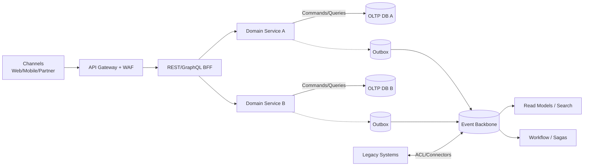

# Target-State Backend Architecture

Modern reference for teams modernizing banking systems. Describes **layers, patterns, and technology options** to converge on.

## Layered View

1) **Edge & Access**
   - API Gateway + WAF: rate limiting, threat protection, coarse authz, request validation.
   - Identity: OIDC/OAuth2, MTLS for partners, token introspection/revocation.
2) **Channel / BFF**
   - Per-channel REST/GraphQL BFFs (web, mobile, partner) to handle session, aggregation, and feature flags.
   - Contract-first APIs (OpenAPI/GraphQL SDL) with backward-compatible evolution.
3) **Domain Services**
   - Domain-aligned services (microservices or modular monolith components) that own business rules and data.
   - Interfaces: synchronous APIs + domain/integration events (AsyncAPI).
   - Patterns: hexagonal architecture, outbox for events, saga/process manager for long-running flows.
4) **Async & Integration**
   - Event backbone (Kafka/Pulsar/PubSub) for domain and integration events.
   - Integration connectors for legacy (MQ/ESB) with anti-corruption layers and strangler routes.
5) **Data & Read Models**
   - Service-owned OLTP stores (Postgres/MySQL/managed equivalents); avoid shared DBs.
   - Read models/projections (CQRS), search (Elasticsearch/OpenSearch), cache (Redis).
   - Data products exposed via APIs/streams with contracts, SLAs, and lineage.
6) **Cross-Cutting Platform**
   - Observability: structured logs, metrics, traces; standard telemetry libraries and dashboards.
   - Delivery: CI/CD, progressive delivery (blue/green, canary), feature flags.
   - Security: secrets management, KMS/HSM, policy-as-code (OPA), supply-chain security (SBOM, signing).
   - Reliability: runtime policy (timeouts/retries/circuit breakers), rate limits, bulkheads, DR patterns.

## Technology Options (illustrative)

- **Edge**: Cloud gateway (API Gateway, Apigee), WAF (Cloudflare/Azure WAF), MTLS for partners, OAuth2/OIDC (Keycloak/Auth0/Cognito/Entra).
- **BFF**: REST (FastAPI/Spring/Express), GraphQL (Apollo/Federation), gRPC for internal hops where appropriate.
- **Domain Services**: JVM (Spring Boot/Quarkus), Node/TypeScript, Go; containerized with Kubernetes; service mesh optional for mTLS/policy/traffic shaping.
- **Async/Event**: Kafka with schema registry, Debezium for CDC, outbox/replay topics; workflow engines (Temporal/Cadence/Camunda) for sagas.
- **Data**: Postgres/MySQL managed services, Redis for cache, S3/GCS for cold storage, OpenSearch/Elasticsearch for search, columnar warehouse (BigQuery/Snowflake) for analytics offload.
- **Observability/Security**: OpenTelemetry, Prometheus/Grafana, Loki/ELK, Vault/Secrets Manager, OPA/Gatekeeper/Kyverno, image signing (Cosign).

## Core Patterns

- **Edge**: Zero-trust, least privilege; JWT validation + MTLS; per-API quotas and threat protection.
- **BFF**: Composition over orchestration; avoid domain logic; keep contracts stable; leverage caching/stitching for GraphQL.
- **Domain**: Hexagonal ports/adapters; idempotent commands; optimistic concurrency; outbox + change data capture for reliable events; immutable domain events.
- **Async**: Event versioning; replayable topics; dead-letter queues with alerting; consumer groups for scaling; backpressure-aware producers.
- **Data**: One write owner per aggregate; CQRS where reads/queries diverge; data quality checks and lineage; soft deletes with TTL where needed.
- **Resilience**: Timeouts, retries with jitter, circuit breakers; bulkheads and load shedding; graceful degradation paths.
- **Security & Compliance**: PII minimization, encryption in transit/at rest, tokenization where required, audit logging, access reviews, retention/expiration policies.

## Minimal Reference Diagram

## Guardrails for Teams

- Prefer asynchronous integration for cross-domain workflows; keep synchronous calls bounded to critical paths with strict SLAs.
- One team owns each service and its data; share via APIs/events, not shared tables.
- Every API/event has a contract (OpenAPI/AsyncAPI) with versioning and deprecation policy.
- Bake in operability: health/readiness probes, SLOs with error budgets, runbooks, synthetic tests.
- Progressive delivery is default; no big-bang cutovers—use strangler patterns and traffic splits.
