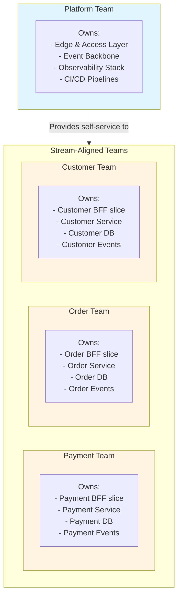
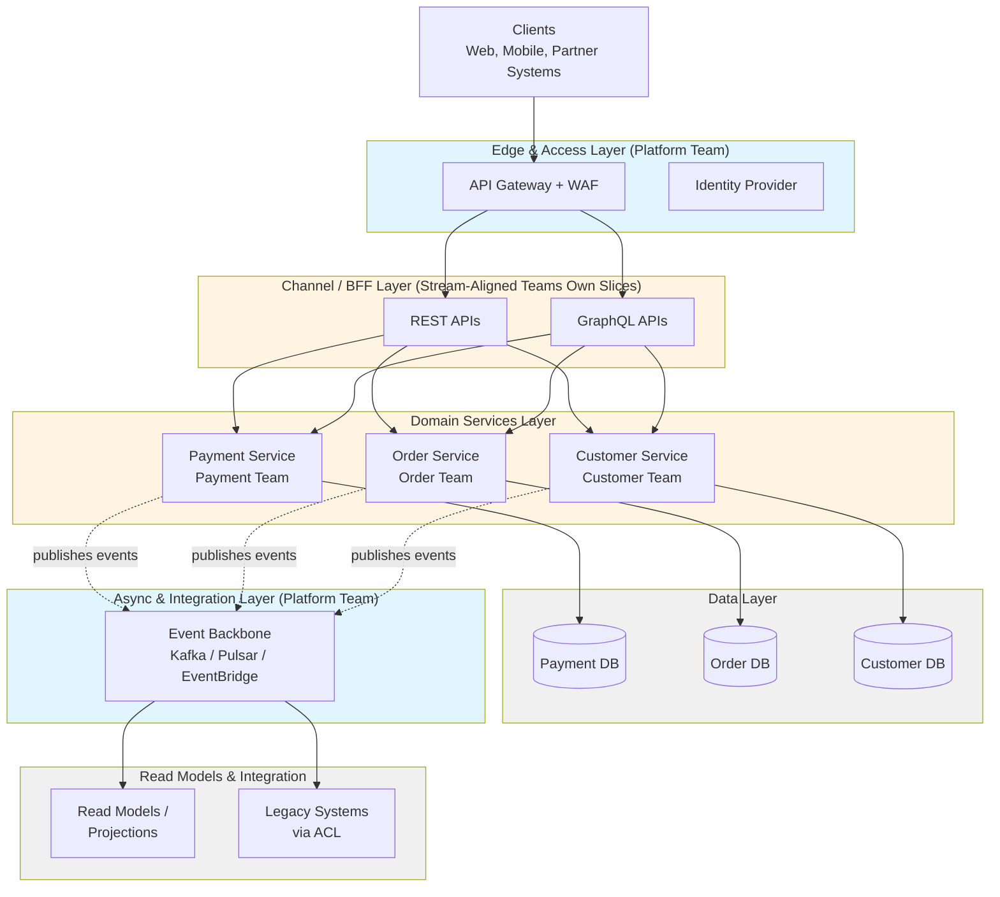
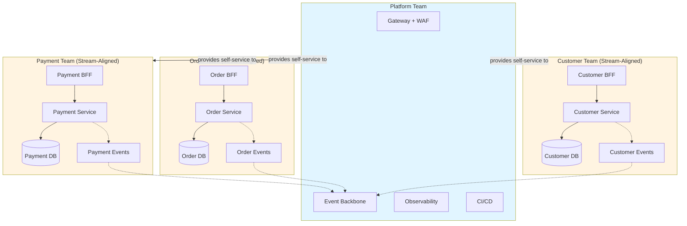

# Target-State Backend Architecture

## Purpose of This Document

This document describes the **target architecture** teams should work toward after modernization. This is the **end state**, not the starting point. Use it to:

- Understand what "good" looks like
- Guide design decisions during modernization
- Align teams on a common architectural vision
- Measure progress (compare current state to target)

> **Important**: You will reach this architecture **incrementally** over 12-36 months using the strangler pattern. Don't try to build everything at once.

---

## Why This Architecture?

This target architecture achieves the [vision](vision.md) outcomes:

**Enables Domain APIs:**
- Clear service boundaries aligned to business domains
- Versioned contracts (OpenAPI/AsyncAPI) between services
- Each domain owned by one team

**Supports Event-Driven Integration:**
- Event backbone for asynchronous communication
- Loose coupling between domains
- Natural audit trail and data distribution

**Improves Developer Experience:**
- Self-service platform capabilities
- Standard patterns and golden paths
- Clear separation of concerns

**Increases Reliability:**
- Observability built-in at every layer
- Resilience patterns (circuit breakers, retries, timeouts)
- Progressive delivery reduces risk

**Reduces Risk:**
- Incremental migration from legacy
- Anti-corruption layers protect from legacy complexity
- Independent deployment per domain

---

## Key Characteristics

What makes this architecture "modern":

**Domain-Driven:**
- Services represent business capabilities, not technical layers
- One team owns each domain end-to-end
- Clear boundaries with explicit contracts

**Loosely Coupled:**
- Services communicate via APIs and events, not shared databases
- Teams can deploy independently
- Changes in one domain don't break others

**Highly Observable:**
- Structured logs, metrics, and traces at every layer
- SLOs defined and monitored
- Easy to debug issues across service boundaries

**Resilient by Design:**
- Failures are expected and handled gracefully
- Circuit breakers prevent cascade failures
- Graceful degradation when dependencies fail

**Platform-Enabled:**
- Self-service capabilities (CI/CD, observability, infrastructure)
- Platform teams provide golden paths
- Stream-aligned teams focus on business logic

---

## Architecture Layers

### 1. Edge & Access Layer

**Purpose:** Protect backend services and provide unified entry point for all clients.

**Components:**
- **API Gateway**: Routing, rate limiting, request validation, protocol translation
- **WAF (Web Application Firewall)**: Threat protection, DDoS mitigation
- **Identity Provider**: Authentication (OIDC/OAuth2), token management, mTLS for partners

**Why this layer:**
- Single point for cross-cutting concerns (auth, rate limiting, logging)
- Protects backend from malicious traffic
- Simplifies client integration (one endpoint, not many)

**Team ownership:** Platform team provides and operates

**Technology examples:**
- Cloud API Gateway (AWS API Gateway, Azure API Management, Google Apigee)
- WAF (Cloudflare, AWS WAF, Azure WAF)
- Identity (Keycloak, Auth0, Cognito, Okta, Entra ID)

---

### 2. Channel / BFF Layer

**Purpose:** Provide tailored APIs for specific channels (web, mobile, partner) by aggregating backend services.

**Components:**
- **BFFs (Backend for Frontend)**: One per channel or client type
- **REST APIs**: For simple request/response patterns
- **GraphQL APIs**: For flexible querying and aggregation

**Why this layer:**
- Reduces over-fetching and under-fetching for clients
- Isolates channel-specific logic from domain services
- Enables independent evolution of client and backend

**Team ownership:** Stream-aligned teams own BFF slices for their domains, or dedicated channel teams

**Key patterns:**
- Composition over orchestration (call multiple services, aggregate responses)
- No business logic (just aggregation and transformation)
- Contract-first (OpenAPI or GraphQL SDL)

**Technology examples:**
- REST: Spring Boot, FastAPI, Express.js, ASP.NET Core
- GraphQL: Apollo Server, GraphQL Yoga, Hot Chocolate
- gRPC: For internal service-to-service calls

---

### 3. Domain Services Layer

**Purpose:** Implement business logic and own domain data. This is where business value is created.

**Components:**
- **Domain Services**: One per bounded context (e.g., Payments, Orders, Customer, Inventory)
- **Business Logic**: Domain models, aggregates, business rules
- **Data Stores**: Service-owned databases (no sharing)

**Why this layer:**
- Clear ownership and accountability
- Business rules are cohesive and localized
- Services can evolve independently

**Team ownership:** Stream-aligned teams (one team per domain)

**Key patterns:**
- **Hexagonal architecture**: Ports and adapters separate business logic from infrastructure
- **Outbox pattern**: Reliable event publishing without dual writes
- **Saga/Process Manager**: Coordinate long-running workflows across domains
- **Idempotency**: Safe retries for commands

**Interfaces:**
- Synchronous APIs (REST/gRPC) for commands and queries
- Domain events (AsyncAPI) for state changes

**Technology examples:**
- JVM: Spring Boot, Quarkus, Micronaut
- Node.js: Express, NestJS, Fastify
- Go: Standard library, Gin, Echo
- .NET: ASP.NET Core
- Python: FastAPI, Django

---

### 4. Async & Integration Layer

**Purpose:** Enable asynchronous communication between domains and integrate with legacy systems.

**Components:**
- **Event Backbone**: Message broker for domain and integration events
- **Schema Registry**: Manage event schemas and versions
- **Integration Connectors**: Anti-corruption layers for legacy systems (ESB, MQ, batch files)
- **Workflow Engines**: Orchestrate sagas and long-running processes

**Why this layer:**
- Loose coupling between domains
- Asynchronous processing for non-critical paths
- Natural audit trail of business events
- Isolates legacy complexity

**Team ownership:**
- Platform team operates event backbone
- Domain teams own their topics and consumers
- Integration team (if exists) manages legacy connectors

**Key patterns:**
- Event versioning and schema evolution
- Dead-letter queues for failed messages
- Consumer groups for scaling
- Idempotent consumers

**Technology examples:**
- Event Backbone: Apache Kafka, Pulsar, RabbitMQ, AWS EventBridge, Azure Event Hubs
- Schema Registry: Confluent Schema Registry, AWS Glue, Azure Schema Registry
- CDC: Debezium, AWS DMS, Striim
- Workflow: Temporal, Cadence, Camunda, AWS Step Functions

---

### 5. Data & Read Models Layer

**Purpose:** Store operational data and provide optimized read models for queries.

**Components:**
- **Service-Owned OLTP Databases**: Each domain service owns its write database
- **Read Models/Projections**: Denormalized views optimized for queries (CQRS)
- **Search Engines**: Full-text search and analytics
- **Caches**: Fast access to frequently read data
- **Data Products**: Curated datasets exposed via APIs/streams

**Why this layer:**
- Data ownership prevents coupling
- Read models optimize for query patterns
- Caching reduces load on OLTP databases
- Search enables discovery and analytics

**Team ownership:**
- Domain teams own their OLTP databases and projections
- Platform team provides shared infrastructure (cache, search)
- Data team (if exists) manages data products and warehouse

**Key patterns:**
- One writer per database (single ownership)
- CQRS where read and write patterns diverge
- Event-driven projections (consume events to build read models)
- Data quality checks and lineage tracking

**Technology examples:**
- OLTP: PostgreSQL, MySQL, SQL Server, MongoDB, DynamoDB
- Cache: Redis, Memcached
- Search: Elasticsearch, OpenSearch, Algolia
- Data Warehouse: Snowflake, BigQuery, Redshift
- Object Storage: S3, GCS, Azure Blob

---

### 6. Cross-Cutting Platform Layer

**Purpose:** Provide self-service capabilities that all teams need (observability, CI/CD, security).

**Components:**
- **Observability**: Logs, metrics, traces, dashboards, alerts
- **CI/CD**: Build, test, deploy pipelines
- **Security**: Secrets management, policy enforcement, vulnerability scanning
- **Reliability**: Service mesh, circuit breakers, rate limiting

**Why this layer:**
- Reduces cognitive load for domain teams
- Ensures consistency across services
- Enables teams to move fast with safety
- Platform team scales support

**Team ownership:** Platform team

**Key capabilities:**
- Self-service (teams can provision without tickets)
- Well-documented with examples
- SLOs for platform services
- Feedback loop with domain teams

**Technology examples:**
- Observability: OpenTelemetry, Prometheus, Grafana, Loki, Jaeger, Datadog, New Relic
- CI/CD: GitHub Actions, GitLab CI, Jenkins, CircleCI, ArgoCD
- Security: HashiCorp Vault, AWS Secrets Manager, OPA, Falco, Cosign
- Service Mesh: Istio, Linkerd, Consul (optional, use when needed)
- Container Platform: Kubernetes, ECS, Cloud Run

---

## Team Alignment to Architecture

How teams map to architecture layers (Team Topologies):

**Key principles:**
- One stream-aligned team per domain
- Platform team provides capabilities, not bottlenecks
- Enabling teams coach and unblock (time-boxed)
- Teams interact via X-as-a-Service (APIs/events with SLAs)

---

## Technology Decision Guidance

The technology examples above are **illustrative, not prescriptive**. Choose based on:

**Organizational Context:**
- Existing skills and experience
- Cloud provider (if committed)
- Licensing and cost constraints
- Support and community

**Technical Requirements:**
- Scale and performance needs
- Compliance and security requirements
- Integration with existing systems
- Operational complexity

**Decision Framework:**

| Layer | Choose REST when... | Choose GraphQL when... | Choose gRPC when... |
|-------|-------------------|---------------------|-------------------|
| **BFF** | Simple CRUD, public APIs | Flexible querying, mobile apps | Not recommended (use REST/GraphQL) |
| **Domain Services** | Standard choice, broad tooling | Not recommended (use REST) | High performance, internal only |

| Layer | Choose SQL when... | Choose NoSQL when... |
|-------|------------------|-------------------|
| **Domain Data** | Relational data, ACID needed | Document model, high scale |

| Layer | Choose Kafka when... | Choose RabbitMQ when... | Choose Cloud Events when... |
|-------|-------------------|---------------------|----------------------|
| **Events** | High throughput, replay needed | Simpler use cases, routing | Cloud-native, managed service |

**Recommendation:** Start with simpler options (REST, SQL, managed services) and add complexity only when needed.

---

## Core Patterns by Layer

### Edge Patterns
- **Zero-trust security**: Validate every request, never trust internal network
- **JWT validation**: Verify tokens at gateway, propagate claims downstream
- **Rate limiting**: Per-client quotas to prevent abuse
- **Request validation**: Reject malformed requests early

### BFF Patterns
- **Composition**: Call multiple services, aggregate responses
- **Caching**: Cache responses to reduce backend load
- **Timeout management**: Set aggressive timeouts, fail fast
- **Error handling**: Translate backend errors to client-friendly messages

### Domain Service Patterns
- **Hexagonal architecture**: Separate business logic from infrastructure
- **Outbox pattern**: Publish events reliably without dual writes
- **Idempotent commands**: Use idempotency keys to prevent duplicates
- **Optimistic concurrency**: Use version numbers to prevent conflicts
- **Domain events**: Publish facts about state changes

### Event Patterns
- **Event versioning**: Include version in event envelope
- **Schema evolution**: Add fields, never remove (backward compatibility)
- **Dead-letter queues**: Capture failed messages for investigation
- **Idempotent consumers**: Handle duplicate events gracefully
- **Replay capability**: Rebuild projections from event history

### Data Patterns
- **Single writer**: One service owns writes to a database
- **CQRS**: Separate read and write models when patterns diverge
- **Event-driven projections**: Build read models by consuming events
- **Soft deletes**: Mark as deleted, don't physically delete (audit trail)
- **Data quality checks**: Validate data at boundaries

### Resilience Patterns
- **Circuit breakers**: Stop calling failing services
- **Retries with jitter**: Retry failed requests with exponential backoff
- **Timeouts**: Set deadlines for all operations
- **Bulkheads**: Isolate resources to prevent cascade failures
- **Graceful degradation**: Provide reduced functionality when dependencies fail

---

## Reference Architecture Diagram

### Logical View

### Physical View (with Team Boundaries)

---

## Migration Path to Target Architecture

You won't build this all at once. Typical progression:

### Phase 1: Foundation (Months 1-6)
- Establish platform capabilities (CI/CD, observability)
- Deploy API gateway and identity provider
- Identify first domain for modernization
- Form first stream-aligned team

### Phase 2: First Domain (Months 3-12)
- Build first domain service with owned database
- Implement outbox pattern for events
- Create BFF for one channel
- Strangler legacy for this domain
- Validate patterns and adjust

### Phase 3: Scale (Months 6-24)
- Modernize additional domains in parallel
- Establish event backbone
- Build read models and projections
- Expand BFF coverage
- Decommission legacy components

### Phase 4: Optimize (Months 18-36)
- Refine domain boundaries based on learnings
- Optimize performance and cost
- Mature platform capabilities
- Complete legacy decommissioning
- Focus on operational excellence

**See [maturity-model.md](maturity-model.md) for detailed progression.**

---

## Success Indicators

You've achieved the target architecture when:

**Technical Indicators:**
- [ ] All critical domains have dedicated services with owned databases
- [ ] No shared databases across domains
- [ ] All APIs have OpenAPI specs, all events have AsyncAPI specs
- [ ] Event backbone is operational with multiple producers/consumers
- [ ] Observability covers all services (logs, metrics, traces)
- [ ] CI/CD pipelines enable daily deployments
- [ ] Legacy systems are decommissioned or in maintenance mode

**Team Indicators:**
- [ ] Stream-aligned teams own domains end-to-end
- [ ] Teams deploy independently without coordination
- [ ] Platform capabilities are self-service
- [ ] Cognitive load per team is manageable

**Business Indicators:**
- [ ] Lead time for changes reduced to days (from weeks/months)
- [ ] Deployment frequency increased to multiple times per week
- [ ] Incident rate reduced by 50%+
- [ ] Time to onboard new developers reduced to < 2 weeks

---

## Anti-Patterns This Architecture Prevents

**Distributed Monolith:**
- ❌ Microservices that can't deploy independently
- ✅ Clear domain boundaries with versioned contracts

**Shared Database Coupling:**
- ❌ Multiple services reading/writing same tables
- ✅ Each service owns its data, shares via APIs/events

**God Services:**
- ❌ One service handling multiple domains
- ✅ One service per bounded context

**Synchronous Coupling:**
- ❌ Long chains of synchronous calls
- ✅ Event-driven integration for cross-domain workflows

**Platform as Bottleneck:**
- ❌ Platform team does work "for" domain teams
- ✅ Self-service capabilities with clear SLAs

**No Observability:**
- ❌ "Check the logs" debugging
- ✅ Structured logs, metrics, traces with correlation IDs

---

## Guardrails for Teams

When designing services, follow these rules:

**Domain Boundaries:**
- One team owns each domain service
- No shared databases across domains
- Share data via APIs or events, never direct DB access

**Contracts:**
- Every API has OpenAPI spec
- Every event has AsyncAPI spec
- Version all contracts (semantic versioning)
- Breaking changes require major version bump

**Communication:**
- Prefer async (events) for cross-domain workflows
- Use sync (APIs) only for critical paths with strict SLAs
- Set timeouts on all external calls
- Implement circuit breakers for resilience

**Data:**
- One writer per database (single ownership)
- Use CQRS when read/write patterns diverge significantly
- Publish events for all state changes
- Make consumers idempotent

**Operability:**
- Expose health and readiness endpoints
- Define SLOs with error budgets
- Emit structured logs with correlation IDs
- Provide runbooks for common issues

**Deployment:**
- Use progressive delivery (canary, blue/green)
- No big-bang cutovers
- Keep rollback capability
- Monitor SLOs during rollout

---

## Next Steps

After understanding the target architecture:

1. **Assess current state** - Use [maturity-model.md](maturity-model.md) to evaluate where you are today
2. **Review principles** - Read [../02-principles/principles.md](../02-principles/principles.md) to understand design principles
3. **Plan migration** - Follow [../03-process/modernization-process.md](../03-process/modernization-process.md) for step-by-step guidance
4. **Choose patterns** - Reference [../04-patterns/](../04-patterns/) for implementation blueprints

---

## Further Reading

- [Building Microservices](https://www.oreilly.com/library/view/building-microservices-2nd/9781492034018/) by Sam Newman
- [Fundamentals of Software Architecture](https://www.oreilly.com/library/view/fundamentals-of-software/9781492043447/) by Mark Richards & Neal Ford
- [Software Architecture: The Hard Parts](https://www.oreilly.com/library/view/software-architecture-the/9781492086888/) by Neal Ford et al.
- [Cloud Native Patterns](https://www.manning.com/books/cloud-native-patterns) by Cornelia Davis
